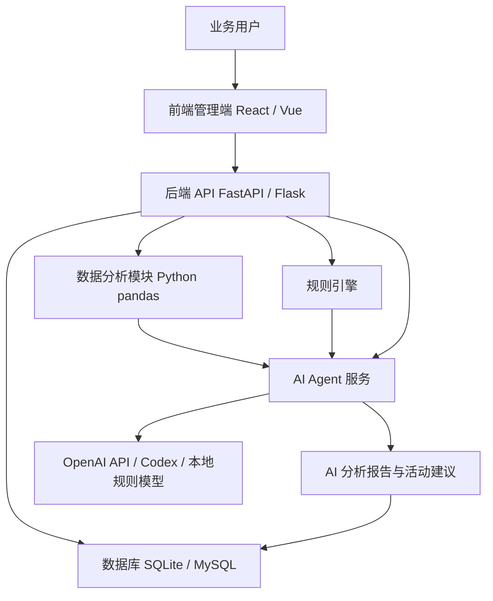
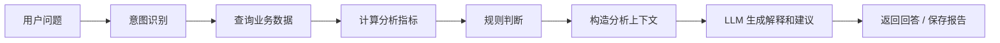

# 酒吧酒水采购、仓储与客户存酒管理 AI Agent 系统技术方案

## 1. 项目概述

### 1.1 项目背景

酒吧经营中，酒水采购、仓储流转、客户存酒、供应商报价和活动策划往往分散在表格、人工记录或不同系统中。随着酒水品类增加、客户存酒规模扩大、供应商价格波动频繁，传统人工管理容易出现库存不准、采购成本异常、临期存酒遗漏、积压酒水难以及时处理等问题。

本项目拟建设一套面向酒吧经营场景的一体化管理系统，覆盖酒水采购、入库出库、库存盘点、客户存酒、供应商管理、智能补货、活动建议和经营分析，并引入 AI Agent 辅助管理人员进行数据查询、异常识别、补货建议和活动方案生成。

### 1.2 建设目标

- 建立统一的酒水商品、供应商、采购、库存、销售消耗和客户存酒数据底座。
- 支持采购单、入库、出库、盘点、损耗、存酒登记、取酒核销等核心业务线上化。
- 通过规则引擎和数据分析识别缺货、积压、价格异常、临期存酒和供应商波动。
- 通过 AI Agent 以自然语言方式回答经营问题，生成补货建议、供应商对比建议、库存分析和活动建议。
- 为后续接入 POS、会员系统、财务系统和多门店管理预留扩展能力。

### 1.3 系统定位

系统定位为酒吧经营管理后台和 AI 决策辅助工具，不替代财务系统或 POS 系统的完整交易能力，而是聚焦酒水供应链、库存和存酒管理，帮助经营者提升数据透明度、采购效率和营销决策质量。

### 1.4 适用角色

- 店长：查看库存、补货建议、成本变化、活动建议和经营报告。
- 采购人员：维护供应商、创建采购单、对比报价、跟踪交付周期。
- 仓库人员：处理入库、出库、盘点、损耗和库存预警。
- 前台/服务人员：登记客户存酒、核销取酒、查看存酒到期提醒。
- 运营人员：基于库存、客户和毛利数据设计活动方案。

## 2. 总体架构设计

### 2.1 架构分层

系统采用前后端分离架构，核心由前端应用、后端 API 服务、数据库、数据分析层、规则引擎和 AI Agent 服务组成。

### 2.2 技术选型建议

| 层级 | 推荐技术 | 说明 |
| --- | --- | --- |
| 前端 | React 或 Vue | 构建管理后台、查询页、表单页、分析看板和 Agent 对话界面 |
| 后端 | FastAPI | 提供 REST API、数据校验、业务服务、Agent 调用入口 |
| 数据库 | SQLite 起步，MySQL 生产 | SQLite 适合 MVP 和单店部署，MySQL 适合生产和多门店扩展 |
| 数据分析 | Python pandas | 用于采购趋势、库存周转、供应商稳定性和客户召回分析 |
| AI Agent | 规则引擎 + LLM | 规则负责确定性判断，LLM 负责自然语言解释和建议生成 |
| 接口文档 | OpenAPI / Swagger | FastAPI 可自动生成接口文档 |
| 部署 | Docker / 本地服务器 / 云服务器 | 根据门店 IT 环境选择部署方式 |

### 2.3 数据流设计

1. 业务人员在前端录入采购、入库、出库、盘点、存酒和销售消耗数据。
2. 后端 API 校验数据并写入业务表。
3. 数据分析模块定期或按需读取采购、库存、销售和存酒数据，计算预警指标。
4. 规则引擎判断缺货、积压、价格异常、临期存酒、供应商波动等情况。
5. AI Agent 汇总结构化分析结果，结合业务上下文生成自然语言回答、活动建议和月度报告。
6. 分析结果写入 `activity_suggestions` 和 `agent_reports`，供用户查看和追踪。

## 3. 核心业务模块

### 3.1 酒水采购管理

采购管理用于记录酒水采购全过程，包括采购单创建、供应商选择、采购价格记录、采购状态跟踪和成本分析。

核心能力：

- 新增采购单，记录商品、供应商、数量、单价、总价、预计到货日期和采购状态。
- 查询采购记录，支持按时间、供应商、商品、状态筛选。
- 供应商报价对比，展示同一商品在不同供应商处的历史价格。
- 采购价格异常识别，当本次采购价明显高于历史均价或近期报价时触发提醒。
- 采购成本趋势分析，按周、月统计采购金额和主要成本变化原因。

### 3.2 酒水仓储管理

仓储管理负责酒水入库、出库、盘点、损耗记录和库存预警，是系统的数据核心。

核心能力：

- 采购到货后创建入库记录，并增加商品库存。
- 销售、调拨、报损或客户取酒时创建出库记录，并减少库存。
- 定期库存盘点，记录系统库存与实际库存差异。
- 损耗记录，区分破损、过期、赠饮、调酒损耗和其他损耗。
- 库存周转率分析，根据库存量和销售消耗计算周转表现。
- 缺货和积压预警，根据安全库存、近期消耗和库存天数自动提示。

### 3.3 客户存酒管理

客户存酒管理用于登记客户寄存酒水、剩余酒量、取酒核销、到期提醒和异常追踪。

核心能力：

- 客户存酒登记，记录客户姓名、联系方式、商品、初始酒量、有效期和备注。
- 剩余酒量维护，支持按瓶、毫升、份数或自定义单位记录。
- 取酒核销，记录取酒时间、取酒量、操作人和核销备注。
- 存酒到期提醒，按有效期提前生成提醒列表。
- 异常记录追踪，例如客户争议、酒标破损、剩余量异常或超期处理。
- 存酒客户召回分析，根据临期、历史消费和剩余酒量筛选适合召回的客户。

### 3.4 供应商管理

供应商管理用于维护供应商基础信息、价格历史、交付表现和评分。

核心能力：

- 供应商信息维护，包括名称、联系人、电话、供货品类、结算方式和备注。
- 采购价格记录，与采购单关联沉淀商品价格历史。
- 交付周期记录，根据采购下单和入库时间计算实际交付天数。
- 价格稳定性分析，根据同一商品的历史价格波动计算供应商稳定性。
- 供应商评分，综合价格、交付、稳定性和异常次数形成评分。

### 3.5 AI Agent 分析模块

AI Agent 是系统的智能分析入口，用于回答经营问题、解释异常原因和生成建议。

核心能力：

- 智能补货建议：结合当前库存、安全库存、近期消耗和采购周期计算建议采购量。
- 采购异常分析：识别采购价格异常、采购成本上升和供应商波动。
- 库存积压分析：识别低周转、高库存、长期未消耗酒水。
- 供应商对比建议：根据价格、稳定性、交付周期和历史异常推荐供应商。
- 月度采购与库存报告生成：汇总采购金额、库存变化、损耗、缺货和积压情况。
- 经营活动建议生成：结合库存、客户存酒、毛利和新品信息生成活动方案。

### 3.6 活动建议模块

活动建议模块将 AI Agent 的分析结果转化为可执行运营动作。

建议类型：

- 库存清理活动：针对低周转、库存高、临期或滞销酒水生成折扣、买赠或套餐方案。
- 客户召回活动：针对快到期存酒客户生成邀约、会员日或专属权益方案。
- 高毛利搭售活动：针对高毛利酒水生成组合套餐、调酒推荐或桌台套餐。
- 新品推广活动：针对新品酒水生成试饮、主题夜、限时首购或社群活动方案。

## 4. 数据模型设计

### 4.1 products 酒水商品表

用于维护酒水商品主数据。

| 字段 | 类型 | 说明 |
| --- | --- | --- |
| id | integer | 商品 ID |
| name | string | 商品名称 |
| category | string | 商品分类，如威士忌、啤酒、红酒、香槟、调酒基酒 |
| brand | string | 品牌 |
| specification | string | 规格，如 700ml、330ml、1L |
| unit | string | 库存单位，如瓶、箱、杯、ml |
| safety_stock | decimal | 安全库存 |
| warning_stock | decimal | 预警库存 |
| cost_price | decimal | 当前参考成本价 |
| sale_price | decimal | 当前参考销售价 |
| gross_margin_rate | decimal | 参考毛利率 |
| status | string | 启用、停用 |
| created_at | datetime | 创建时间 |
| updated_at | datetime | 更新时间 |

### 4.2 suppliers 供应商表

用于维护供应商信息和评分基础。

| 字段 | 类型 | 说明 |
| --- | --- | --- |
| id | integer | 供应商 ID |
| name | string | 供应商名称 |
| contact_name | string | 联系人 |
| phone | string | 联系电话 |
| supplied_categories | string | 供货品类 |
| settlement_method | string | 结算方式 |
| average_delivery_days | decimal | 平均交付周期 |
| price_stability_score | decimal | 价格稳定性评分 |
| service_score | decimal | 服务评分 |
| status | string | 启用、停用 |
| notes | text | 备注 |
| created_at | datetime | 创建时间 |
| updated_at | datetime | 更新时间 |

### 4.3 purchase_orders 采购单表

用于记录采购订单和商品明细。MVP 可将采购单头和明细合并在一张表，后续可拆分为 `purchase_orders` 和 `purchase_order_items`。

| 字段 | 类型 | 说明 |
| --- | --- | --- |
| id | integer | 采购记录 ID |
| order_no | string | 采购单号 |
| supplier_id | integer | 供应商 ID |
| product_id | integer | 商品 ID |
| quantity | decimal | 采购数量 |
| unit_price | decimal | 采购单价 |
| total_amount | decimal | 采购总价 |
| order_date | date | 下单日期 |
| expected_arrival_date | date | 预计到货日期 |
| actual_arrival_date | date | 实际到货日期 |
| status | string | 草稿、已下单、部分到货、已完成、已取消 |
| price_anomaly_flag | boolean | 是否存在价格异常 |
| notes | text | 备注 |
| created_at | datetime | 创建时间 |
| updated_at | datetime | 更新时间 |

### 4.4 inventory_records 库存流水表

用于记录所有库存变动，是库存计算和审计的依据。

| 字段 | 类型 | 说明 |
| --- | --- | --- |
| id | integer | 流水 ID |
| product_id | integer | 商品 ID |
| record_type | string | 入库、出库、盘点、损耗、调整 |
| quantity_change | decimal | 变动数量，入库为正，出库为负 |
| quantity_after | decimal | 变动后库存 |
| related_order_id | integer | 关联采购单或业务单据 ID |
| reason | string | 原因，如采购入库、销售消耗、客户取酒、破损 |
| operator_name | string | 操作人 |
| occurred_at | datetime | 发生时间 |
| notes | text | 备注 |

### 4.5 sales_records 销售消耗表

用于记录商品销售或消耗数据，可由人工录入或后续从 POS 导入。

| 字段 | 类型 | 说明 |
| --- | --- | --- |
| id | integer | 销售记录 ID |
| product_id | integer | 商品 ID |
| quantity | decimal | 销售或消耗数量 |
| sale_amount | decimal | 销售金额 |
| sale_date | date | 销售日期 |
| channel | string | 销售渠道，如堂食、活动、套餐、赠饮 |
| gross_profit | decimal | 毛利 |
| notes | text | 备注 |
| created_at | datetime | 创建时间 |

### 4.6 customer_storage 客户存酒表

用于记录客户存酒及核销状态。

| 字段 | 类型 | 说明 |
| --- | --- | --- |
| id | integer | 存酒记录 ID |
| customer_name | string | 客户姓名 |
| customer_phone | string | 客户电话 |
| product_id | integer | 存酒商品 ID |
| initial_quantity | decimal | 初始存酒量 |
| remaining_quantity | decimal | 剩余酒量 |
| unit | string | 单位 |
| stored_at | datetime | 存酒时间 |
| expires_at | datetime | 到期时间 |
| status | string | 有效、已取完、已过期、异常 |
| last_pickup_at | datetime | 最近取酒时间 |
| abnormal_flag | boolean | 是否异常 |
| abnormal_notes | text | 异常说明 |
| created_at | datetime | 创建时间 |
| updated_at | datetime | 更新时间 |

### 4.7 activity_suggestions 活动建议表

用于保存 AI Agent 生成的活动方案。

| 字段 | 类型 | 说明 |
| --- | --- | --- |
| id | integer | 建议 ID |
| suggestion_type | string | 库存清理、客户召回、高毛利搭售、新品推广 |
| title | string | 活动标题 |
| target_products | text | 目标商品 ID 列表或名称 |
| target_customers | text | 目标客户列表或筛选条件 |
| reason | text | 生成原因 |
| action_plan | text | 活动执行方案 |
| expected_effect | text | 预期效果 |
| status | string | 待评估、已采纳、已执行、已忽略 |
| generated_at | datetime | 生成时间 |
| created_by_agent | boolean | 是否由 Agent 生成 |

### 4.8 agent_reports AI 分析报告表

用于保存 AI Agent 的分析结果和报告历史。

| 字段 | 类型 | 说明 |
| --- | --- | --- |
| id | integer | 报告 ID |
| report_type | string | 补货建议、库存分析、采购异常、供应商对比、月度报告 |
| title | string | 报告标题 |
| input_snapshot | text | 分析输入数据快照 |
| result_summary | text | 结果摘要 |
| result_detail | text | 详细报告 |
| risk_level | string | 低、中、高 |
| generated_at | datetime | 生成时间 |
| generated_by | string | 生成来源，如规则引擎、LLM、人工触发 |

## 5. AI Agent 设计

### 5.1 Agent 能力边界

AI Agent 负责经营辅助分析和自然语言输出，不直接绕过业务规则修改库存、采购单或客户存酒记录。涉及实际库存变动、采购下单、客户核销等操作时，Agent 只能生成建议，由业务人员确认后执行。

### 5.2 可回答的问题

- 本周哪些酒水快缺货？
- 哪些酒水库存积压？
- 下周建议采购哪些酒水，各买多少？
- 哪个供应商价格更稳定？
- 本月采购成本为什么上升？
- 哪些客户存酒快到期？
- 可以针对哪些酒水做促销活动？
- 哪些客户适合做存酒召回？

### 5.3 Agent 工作流程

### 5.4 规则引擎设计

规则引擎负责生成确定性结论，避免完全依赖 LLM。

| 规则类型 | 判断逻辑 |
| --- | --- |
| 缺货预警 | 当前库存低于安全库存，或预计库存可用天数低于采购周期 |
| 积压预警 | 当前库存高于近 30 天销量的指定倍数，且周转率低 |
| 采购价格异常 | 本次单价高于近 3 次均价或近 30 天均价超过设定比例 |
| 供应商不稳定 | 同一商品价格波动率高，或交付周期偏差大 |
| 存酒到期提醒 | 存酒到期时间进入 7 天、15 天或 30 天提醒窗口 |
| 客户召回 | 客户存酒临期、剩余量较多、近期未到店或高价值客户 |

### 5.5 LLM 输出控制

LLM 主要负责解释和生成建议，输入应为后端整理后的结构化摘要，不直接读取数据库原始全量数据。

输出要求：

- 明确结论，例如“建议补货”“建议促销”“需关注供应商价格波动”。
- 给出原因，例如库存低于安全线、近期销量增长、采购价上涨。
- 给出可执行动作，例如采购数量、推荐供应商、活动形式、客户召回话术方向。
- 标注风险和假设，例如销售数据不完整、POS 尚未接入、部分成本为人工录入。

### 5.6 Agent 报告模板

报告建议包含以下结构：

1. 分析结论
2. 关键数据
3. 异常或机会点
4. 建议动作
5. 风险提示
6. 后续跟踪指标

## 6. 关键业务流程

### 6.1 采购入库流程

1. 采购人员创建采购单，选择供应商和酒水商品。
2. 系统记录采购数量、单价、预计到货日期和采购状态。
3. 规则引擎检查价格是否高于历史水平，标记异常。
4. 商品到货后，仓库人员确认入库。
5. 系统创建库存入库流水，并更新商品库存。
6. 供应商交付周期被记录，用于后续评分。

### 6.2 销售出库流程

1. 销售或消耗数据由人工录入，后续可由 POS 导入。
2. 系统创建销售消耗记录。
3. 同步创建库存出库流水，减少商品库存。
4. 数据分析模块更新销量、周转率和毛利指标。
5. 若库存低于预警阈值，系统生成缺货提醒。

### 6.3 客户存酒登记与取酒核销流程

1. 服务人员登记客户存酒，录入客户信息、酒水、初始量和有效期。
2. 客户取酒时录入取酒量，系统更新剩余酒量。
3. 剩余量为零时，存酒状态变为已取完。
4. 临近到期时，系统生成提醒。
5. 如出现争议、破损或数量异常，记录异常状态和说明。

### 6.4 智能补货流程

1. Agent 读取当前库存、安全库存、近 7 天或 30 天销量、采购周期。
2. 计算预计可售天数和建议采购量。
3. 结合供应商价格和交付表现推荐采购来源。
4. 输出补货建议报告。
5. 采购人员确认后创建采购单。

### 6.5 活动建议生成流程

1. 系统识别低周转、高库存、高毛利、新品和临期存酒客户。
2. Agent 将数据转化为活动机会点。
3. LLM 生成活动标题、目标商品、目标客户、执行动作和预期效果。
4. 运营人员评估后选择采纳、执行或忽略。
5. 后续可关联销售数据评估活动效果。

## 7. 接口与页面规划

### 7.1 API 分组

| API 分组 | 说明 |
| --- | --- |
| `/api/products` | 商品新增、编辑、查询、停用、库存概览 |
| `/api/suppliers` | 供应商维护、评分查询、价格历史查询 |
| `/api/purchase-orders` | 采购单创建、查询、状态更新、到货确认 |
| `/api/inventory` | 入库、出库、盘点、损耗、库存流水查询 |
| `/api/sales-records` | 销售消耗录入、查询、导入 |
| `/api/customer-storage` | 存酒登记、取酒核销、到期提醒、异常记录 |
| `/api/analytics` | 库存周转、成本趋势、供应商稳定性、客户召回分析 |
| `/api/agent` | 自然语言问答、补货建议、异常分析、报告生成 |
| `/api/activity-suggestions` | 活动建议查询、采纳、执行、忽略 |
| `/api/reports` | AI 报告列表、详情、导出 |

### 7.2 前端页面规划

| 页面 | 主要功能 |
| --- | --- |
| 首页仪表盘 | 缺货提醒、积压提醒、临期存酒、采购成本、本月损耗、Agent 快捷问题 |
| 酒水商品管理 | 商品档案、分类、规格、安全库存、价格和毛利 |
| 采购管理 | 采购单、供应商报价对比、价格异常提示 |
| 仓储管理 | 入库、出库、盘点、损耗、库存流水 |
| 客户存酒管理 | 存酒登记、取酒核销、到期提醒、异常记录 |
| 供应商管理 | 供应商档案、价格历史、交付周期、评分 |
| AI Agent 分析 | 自然语言问答、补货建议、异常分析、月度报告 |
| 活动建议 | 库存清理、客户召回、套餐搭售、新品推广方案 |
| 报表中心 | 采购报表、库存报表、损耗报表、客户存酒报表、AI 报告 |
| 系统设置 | 基础字典、预警阈值、角色权限、门店配置 |

### 7.3 页面交互原则

- 高风险操作需要确认，例如库存调整、损耗记录、存酒异常处理。
- 所有库存变化必须形成流水，避免直接修改库存数值。
- Agent 输出的建议应提供“采纳”“忽略”“生成采购单”“生成活动建议”等后续操作入口。
- 关键指标应可追溯到原始业务记录，便于人工复核。

## 8. 部署与实施计划

### 8.1 MVP 阶段

目标是完成单店可用的核心闭环。

交付内容：

- 商品、供应商、采购单、库存流水、销售消耗、客户存酒基础管理。
- SQLite 数据库和基础数据初始化脚本。
- 首页基础预警，包括缺货、积压、临期存酒。
- 规则型补货建议和采购价格异常识别。
- Agent 问答入口，支持基于规则结果生成自然语言回答。

### 8.2 增强阶段

目标是提升经营分析和运营辅助能力。

交付内容：

- 供应商评分、价格稳定性、交付周期分析。
- 库存周转率、损耗分析、采购成本趋势。
- 活动建议模块。
- 月度采购与库存报告生成。
- Excel 导入导出和报表下载。

### 8.3 AI 智能化阶段

目标是提升 Agent 的自动分析能力和可解释性。

交付内容：

- 更完整的自然语言问答能力。
- Agent 报告历史和分析依据追溯。
- 活动建议效果跟踪。
- 基于历史销售和活动数据优化补货建议。
- 接入 OpenAI API 或企业内部 LLM 服务。

### 8.4 扩展阶段

目标是支持更复杂的经营场景。

扩展方向：

- 对接 POS 系统，自动同步销售消耗。
- 对接会员系统，增强客户召回分析。
- 支持多门店库存、调拨和集中采购。
- 支持移动端扫码入库、出库和存酒核销。
- 支持权限、审批流和操作审计。

## 9. 交付成果

项目交付建议包含以下内容：

- 前端管理端源码。
- 后端 API 服务源码。
- 数据库建表脚本和初始化数据。
- API 接口文档。
- 系统部署说明。
- 测试数据和演示账号。
- AI Agent 分析规则说明。
- 月度采购与库存报告模板。
- 活动建议报告模板。
- 用户操作手册。

## 10. 风险与边界

### 10.1 数据准确性风险

库存分析、补货建议和活动建议依赖采购、库存、销售和存酒数据的准确性。若销售消耗未及时录入或 POS 尚未接入，系统应在 Agent 报告中提示数据完整性风险。

### 10.2 AI 输出边界

AI Agent 输出的是经营建议，不应自动执行采购下单、库存调整、客户核销或财务相关操作。所有涉及业务状态变更的动作必须由授权人员确认。

### 10.3 实施边界

MVP 阶段优先完成单店、单仓库、人工录入场景，不包含复杂财务结算、多门店调拨、供应商在线协同和 POS 实时对接。上述能力可作为后续扩展建设。

## 11. 验收建议

### 11.1 功能验收

- 能完成商品、供应商、采购、库存、销售消耗和客户存酒的基础数据维护。
- 能通过采购入库和销售出库自动形成库存流水。
- 能展示缺货、积压、临期存酒和采购价格异常提醒。
- 能生成补货建议、供应商对比建议和活动建议。
- 能保存并查看 AI 分析报告。

### 11.2 数据验收

- 业务单据与库存流水数量一致。
- 商品库存可由库存流水回溯计算。
- 采购价格、供应商、销售消耗和存酒记录可关联查询。
- Agent 报告中的关键数据可追溯到原始记录。

### 11.3 体验验收

- 店长能在首页快速看到需要处理的问题。
- 采购人员能快速判断哪些酒水需要补货。
- 仓库人员能清晰完成入库、出库、盘点和损耗记录。
- 服务人员能快速查询和核销客户存酒。
- 运营人员能基于系统建议制定活动方案。
